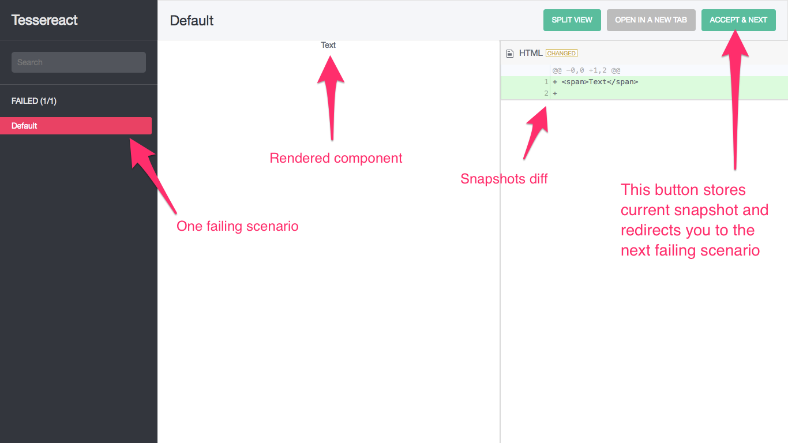
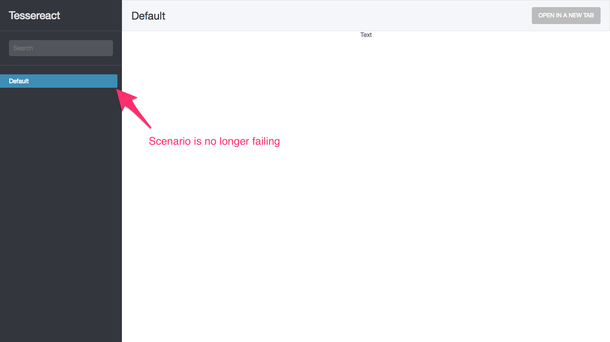
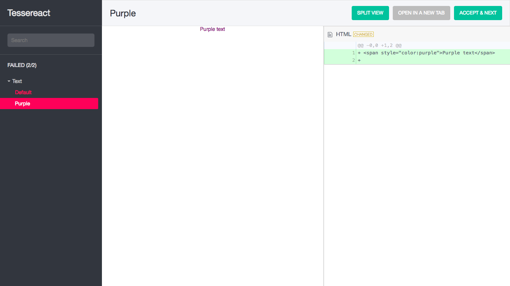
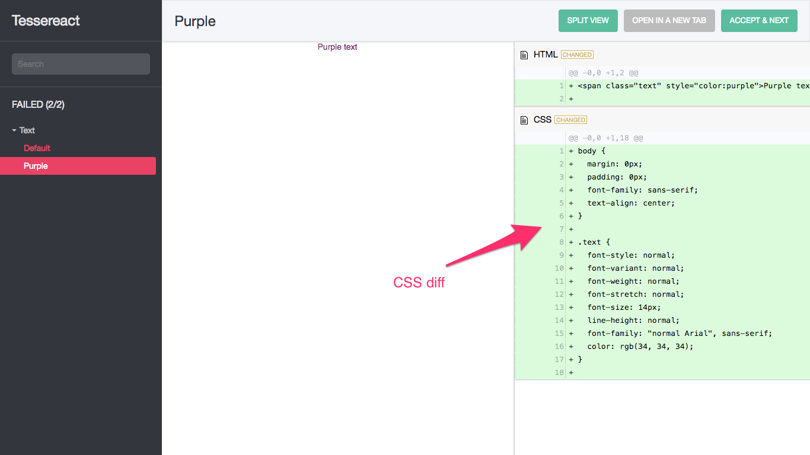
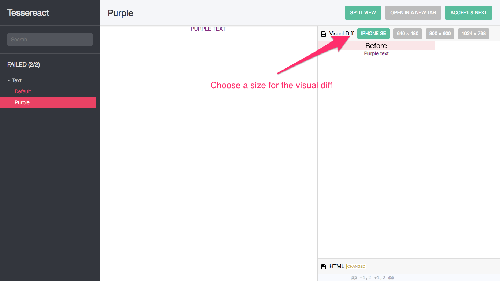

# Usage

Let's write a Tessereact scenario for this dummy `Text` component.

``` js
// src/Text/index.jsx

import React, {Component} from 'react'

export default class Text extends React.Component {
  render () {
    const {color, children} = this.props
    const style = color ? {color} : {}

    return <span style={style}>
      {this.props.children}
    </span>
  }
}
```

### Create a `scenario`

``` js
// src/Text/scenarios.jsx

import React from 'react'
import {scenario} from 'tessereact'
import Text from '.'

scenario('Default', () => (
  <Text>Text</Text>
))
```

When you open Tessereact you are going to see the following screen.



You can specify these options as the third argument of `scenario` function:

- `css` — compares CSS, which is used in this particular scenario.

- `screenshot` — allows to request a visual diff from the server.
  For this option, you have to have [ImageMagick](http://www.imagemagick.org) installed.

``` js
// src/Text/scenarios.jsx

import React from 'react'
import {scenario} from 'tessereact'
import Text from '.'

scenario('Default', () => (
  <Text>Text</Text>
), {css: true, screenshot: true})
```

### Accept the `snapshot`

If you click "Accept & next" button current snapshot will be stored and override the previous one.
           https://www.evernote.com/shard/s17/sh/aa171897-f7d2-4d80-aa46-63702b6bbcff/17fb167e4f595cb6/res/4b613454-df24-4631-8737-3f317e9444ce/skitch.png



You can change the component and repeat acceptance process.

### Add a `context`

When you have multiple scenarios for the component or some particular flow it's a good idea to
group them into a context to not bloat the navigation bar.

``` js
// src/Text/scenarios.jsx

import React from 'react'
import {context, scenario} from 'tessereact'
import Text from '.'

context('Text', () => {
  scenario('Default', () => (
    <Text>Text</Text>
  ))

  scenario('Purple', () => (
    <Text color='purple'>Purple text</Text>
  ))
})
```

It's going to look like this.



### Using CSS diff

Add CSS file:

```css
/* src/Text/index.css */

body {
  margin: 0;
  padding: 0;
  font-family: sans-serif;
  text-align: center;
}

.text {
  font: 14px normal Arial, sans-serif;
  color: #222;
}
```

Modify the component to make use of CSS. Import the CSS.

``` js
// src/Text/index.jsx

import React from 'react'
import './index.css'

export default class Text extends React.Component {
  render () {
    const {color, children} = this.props
    const style = color ? {color} : {}

    return <span className='text' style={style}>
      {this.props.children}
    </span>
  }
}
```

Enable `css` option on scenarios:

``` js
// src/Text/scenarios.jsx

import React from 'react'
import {context, scenario} from 'tessereact'
import Text from '.'

context('Text', () => {
  scenario('Default', () => (
    <Text>Text</Text>
  ), {css: true})

  scenario('Purple', () => (
    <Text color='purple'>Purple text</Text>
  ), {css: true})
})
```



### Using visual diff

Let's accept the snapshots before the next step.

Enable `screenshot option` on scenarios and change them:

```js
context('Text', () => {
  scenario('Default', () => (
    <Text>TEXT</Text>
  ), {css: true, screenshot: true})

  scenario('Purple', () => (
    <Text color='purple'>PURPLE TEXT</Text>
  ), {css: true, screenshot: true})
})
```



The exact appearance of the visual diff and the sizes are configurable.
Check [Tessereact configuration guide](./usage.md) for the list of options.
